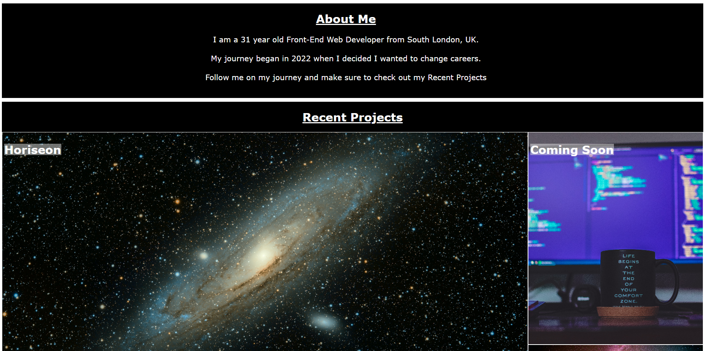
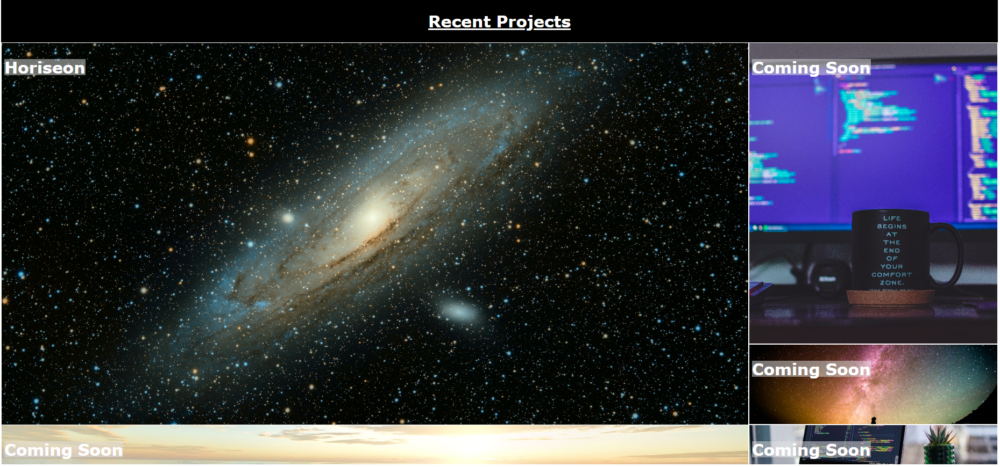

# NoelGalvinPortfolio

Here is the deployed website link: 
https://ngalvin1991.github.io/NoelGalvinPortfolio/

## Description
The objective of this challenge was to create a portfolio web page for my current and future Front-End Web Development projects. The reason behind this is to showcase my work to future employers to show them the skills I have learnt and the websites that I have created during my time as a Front-End Web Developer.
There was certain criteria to be met which included the following: 

    The page heading shows my name and a display photo/avatar of myself, along with links to each aspect of the page include About Me, Recent Projects and how to contact me.

    The project section of the webpage was to include titled images, which once the image is clicked on it will lead you to the website. 

    The first project was to be larger than the others, this was done by using the display grid CSS. 

    The webpage was also to conform to different screen sizes using media queries. 

## Installation

N/A 

## Usage

The idea was to build your own page while all functions were to be the same as the original challenge requirements. 

This was done by laying out the relevant HTML correctly so that each section was in order, as well as abiding by this within the CSS so it is easier to follow (see example below).

This then coinsides with the flow of the website as per the example of the website below:

As per the instructions it was stated that the first project had to be larger than the other others, this was done by using a grid layout as shown below: 

## Credits

Here are some useful links that assisted the completion of this project: 

https://www.w3schools.com/
https://developer.mozilla.org/

## License 

GNU GENERAL PUBLIC LICENSE, Version 3, 29 June 2007